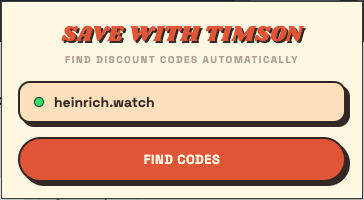
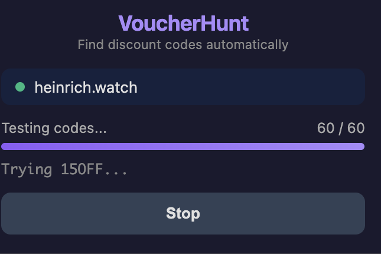

# Save with Timson

**Stop paying full price.** This Chrome extension hunts down working discount codes on any Shopify checkout. Automatically.

One click. It scrapes Reddit, coupon sites, and generates smart guesses based on the store name and season. Then it tries them all, one by one, and keeps the best one applied.

No accounts. No API keys. No nonsense.

---

### Ready to go



### Hunting



### Money saved


---

## How it Works

**1. Scrape** / Pulls codes from Reddit threads and coupon aggregators for the store you're on

**2. Generate** / Builds likely codes from the brand name + whatever holiday or season is happening right now

**3. Guess** / Throws in the classics like `WELCOME10`, `SAVE20`, `FREESHIP`, and dev leftovers like `TEST` and `STAFF10`

**4. Apply** / Enters each code, clicks the button, reads the result, moves on. Keeps the biggest discount it finds.

## How to get it

```bash
git clone https://github.com/TimEckert/SaveWithTimson.git
```

1. Open `chrome://extensions` and flip on **Developer mode**
2. Hit **Load unpacked** and pick the cloned folder
3. Go to any Shopify checkout and click the extension

## The Specs

- Works on **any Shopify store**, in any language
- **60 codes per batch**, hit "Keep Going" for more
- Remembers what worked, per store
- Keeps running when you switch tabs
- Reconnects if you close and reopen the popup
- **Zero API keys**. Reddit's public `.json` endpoint + good old HTML scraping

## In the Back of the End

```
manifest.json              Manifest V3
background/service-worker  Orchestration + discovery
content/shopify            Checkout DOM interaction
lib/lookup                 Reddit + coupon scrapers
lib/generator              Smart code generation
lib/codes                  Common Shopify codes
lib/seasons                Holiday detection
popup/*                    The UI you see
```

## License

MIT
